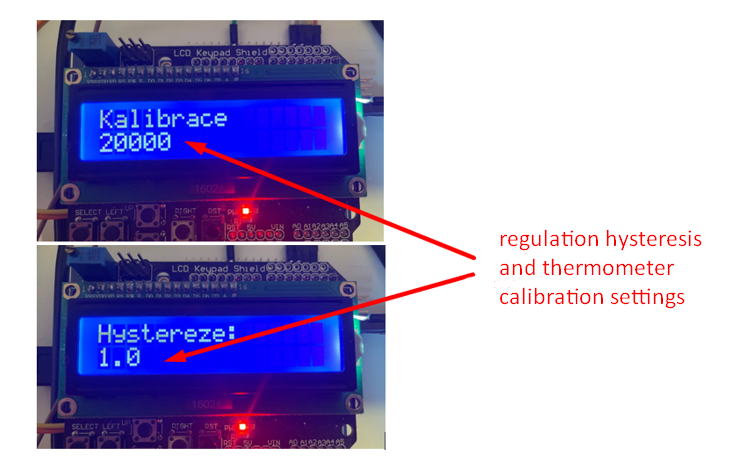

# ATmega328P-Thermostat-Automation
Automated thermostat system for ATmega328P microcontroller, controlling heating and cooling using relays, displaying temperature and settings on a screen, with user-friendly adjustment and remote Modbus RTU control options.

This project implements a straightforward and intuitive automatic thermostat using the ATmega328P microcontroller. The thermostat features a user-friendly interface where a rotary encoder allows navigation through four screens, resembling a carousel:

- **Main screen** (date, time, current temperature, desired temperature)
- **Setting 1:** Date and time (adjustable)
- **Setting 2**: Regulator hysteresis (adjustable)
- **Setting 3**: Thermometer calibration (adjustable)

On each screen, values can be adjusted by rotating the encoder:

- **Main screen:** Desired temperature
- **Setting 1:** Date and time
- **Setting 2:** Regulator hysteresis
- **Setting 3:** Thermometer calibration

For Setting 1 (date and time), the encoder button cycles through date, month, hour, minute, and second, with each position allowing adjustment of the corresponding value. While there's no explicit cursor indication, users can identify the selected position by the number of button presses or by observing the changing value.

Data persistence is ensured by storing and retrieving settings from EEPROM memory, preventing data loss during power loss. The relays are configured with a maximum switching frequency of 1 Hz, while hysteresis operates as a two-state value. Thermometer calibration involves adjusting the resistance trimmer.

An innovative aspect of this project is the Modbus RTU protocol library, which enables communication between a master device and the ATmega slave. Though not fully implemented in the main program, the library has been tested on the ATmega328P and is ready for use.

# Images

## Installation and Setup

1. Clone this repository to your local machine.
2. Follow the hardware setup instructions in the user manual.
3. Upload the program to your ATmega328P microcontroller.
4. Follow the usage instructions in the user manual to operate the thermostat.
   
## Pin Connections

### UART
| UART | ATmega328P |
|------|------------|
| PDO  | RX         |
| PD1  | TX         |

### Relay
| Relay | ATmega328P |
|-------|------------|
| GND   | GND        |
| IN1   | PC2        |
| IN2   | PC3        |
| VCC   | VCC        |

### Encoder
| Encoder | ATmega328P |
|---------|------------|
| CLK     | D4         |
| DT      | D3         |
| SW      | B3         |
| GND     | GND        |

### HW-111 RTC I2C
| HW-111 | ATmega328P |
|--------|------------|
| SQ     | PD2        |
| DS     | -          |
| SCL    | PC5        |
| SDA    | PC4        |
| VCC    | VCC        |
| GND    | GND        |
| BAT    | -          |
